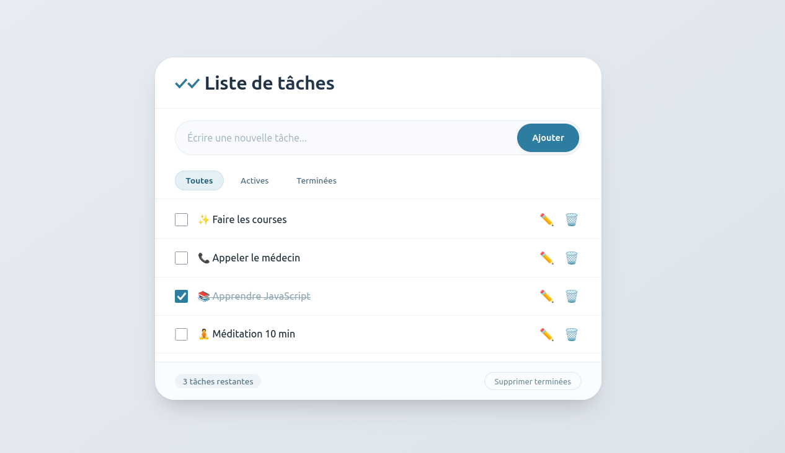

# ✅ TaskFlow – Application de gestion de tâches

> Une application web moderne, légère et persistante pour organiser votre quotidien.


---

## 📖 Table des matières

1. [À propos](#-à-propos)
2. [Fonctionnalités](#-fonctionnalités)
3. [Sortie sur web](#-sortie-sur-web)
4. [Technologies utilisées](#-technologies-utilisées)
5. [Installation et utilisation](#-installation-et-utilisation)
   - [Méthode 1 : Navigateur (fichier HTML)](#méthode-1--navigateur-fichier-html)
   - [Méthode 2 : Serveur Docker (recommandé)](#méthode-2--serveur-docker-recommandé)


---

## 🧐 À propos

**TaskFlow** est une application web de gestion de tâches (to-do list) qui fonctionne entièrement côté client. Elle ne nécessite aucune base de données ni serveur backend. Les données sont sauvegardées automatiquement dans le `localStorage` de votre navigateur. Vous pouvez l'utiliser hors ligne après le premier chargement.

Ce projet a été conçu pour être :
- **Rapide** : pas de dépendances externes, chargement instantané.
- **Responsive** : s'adapte aux mobiles, tablettes et desktop.
- **Accessible** : navigation clavier, contrastes lisibles.
- **Prêt pour la production** : livré avec un `Dockerfile` pour un déploiement immédiat.

---

## ✨ Fonctionnalités

| Fonctionnalité | Description |
|----------------|-------------|
| ➕ Ajout de tâche | Saisie de texte + bouton ou touche `Entrée` |
| ✅ Case à cocher | Marquer une tâche comme terminée / active |
| ✏️ Modification en ligne | Clic sur ✏️, validation via `Entrée` ou bouton ✓ |
| 🗑️ Suppression individuelle | Bouton poubelle par tâche |
| 🔍 Filtres dynamiques | Toutes / Actives / Terminées (sans rechargement) |
| 🧹 Nettoyage groupé | Supprimer toutes les tâches terminées en un clic |
| 📊 Compteur | Affiche le nombre de tâches restantes |
| 💾 Persistance | Sauvegarde automatique dans `localStorage` |
| 📱 Responsive | Interface fluide sur tous les écrans |
| ⌨️ Raccourcis clavier | `Entrée` pour ajouter/modifier, `Échap` pour annuler |
| 🐳 Dockerisé | Image Nginx alpine prête à être déployée |

---

## 📸 Sortie sur web 



---

## 🛠 Technologies utilisées

- **HTML5** – Structure sémantique
- **CSS3** – Flexbox, Grid, animations douces, thème clair
- **JavaScript (ES6+)** – Manipulation du DOM, gestion d'état, événements
- **LocalStorage API** – Persistance des données
- **Docker** – Conteneurisation avec `nginx:alpine`

Aucune bibliothèque externe ou framework n’est utilisé → vanilla JS pur.

---

## 🚀 Installation et utilisation

### Méthode 1 : Navigateur (fichier HTML)

1. **Téléchargez** le fichier `task_list.html`.
2. **Ouvrez-le** avec votre navigateur (double-clic ou glisser-déposer).
3. **Utilisez** l’application immédiatement.

> ⚠️ Attention : les données sont liées au navigateur et à l'origine (fichier local). Si vous déplacez le fichier, les tâches restent accessibles tant que vous utilisez le même navigateur et le même chemin.

### Méthode 2 : Serveur Docker (recommandé pour production)

Cette méthode permet d’exposer l’application sur un réseau, de la mettre derrière un reverse proxy, ou de l’utiliser dans un environnement conteneurisé.

#### 2.1 Prérequis

- Docker installé ([docker.com](https://docker.com))
- (Optionnel) Docker Compose

#### 2.2 Construction de l’image

```bash
# Clonez ou placez-vous dans le dossier contenant le Dockerfile et task_list.html
docker build -t taskflow:latest .

